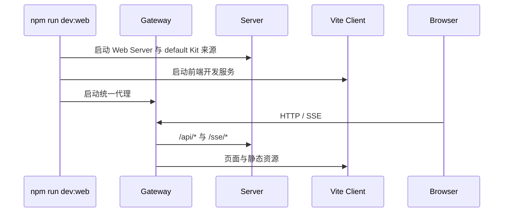

# 核心运行流程

## Web 开发栈启动

`npm start` 使用 `packages/server/src/start.ts` 直接启动稳定 Web Server；`HARBORS_SERVER_PORT` 和 `HARBORS_BIND_HOST` 可覆盖默认监听。运行数据位于 `.data/`。

## 会话创建与 bootstrap

浏览器请求创建 session 后，`SessionRuntimeRegistry` 建立 Editor，装配 default Kit，加载插件并生成布局、菜单和国际化快照。Client 获取 bootstrap 后渲染工作台，并用 SSE 接收后续变化。

## Panel 消息

Panel 只能通过注入的 runtime API 发送 request 或 broadcast。Server 校验 session、插件所有权和消息路由；request 必须有唯一处理器，broadcast 允许多个订阅者。

## Kit 与插件失败清理

插件装载中途失败时，Editor 按 owner 清除 Panel、Message、Menu 等贡献。Kit 切换失败时清理新集合并尽力恢复旧集合，避免留下半装载状态。

## Kit 本地校验与打包

Kit 源码由本地 `kits/` 目录发现。开发者先以 `npm run kit -- validate` 校验 descriptor 与声明文件，再以 `npm run kit -- pack` 生成 `.hkit`，并用 `npm run kit -- inspect` 检查制品内容。合并源码不会触发额外的制品分发流程。
